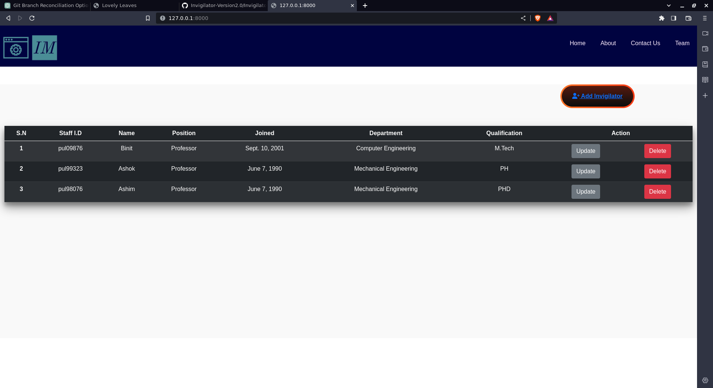

# Simple Ecommerce for plant nursery

## Description
This is a simple website for local plant nursery.

## Setup and Installation
To install all project dependencies, run the following command:

```bash
pipenv install
```

## Activate the Environment

To activate the virtual environment, use the following command:

```bash
pipenv shell
```

## Running the Project
Navigate to the project directory:

```bash
cd  Invigilator
```

To run the project, execute the following command:

```bash
pipenv run python3 manage.py runserver

```

## Home page




